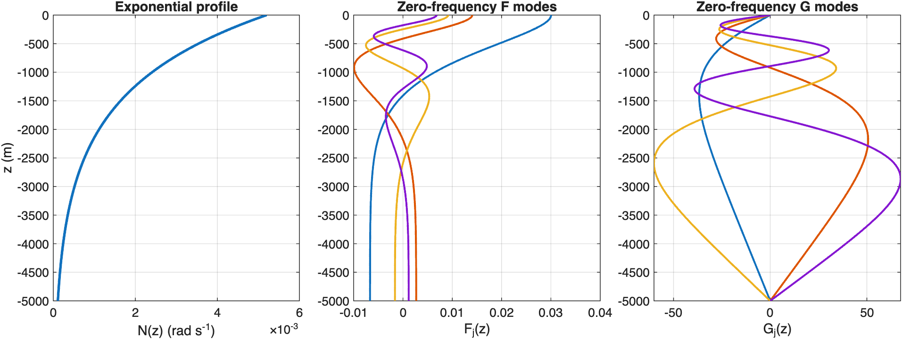
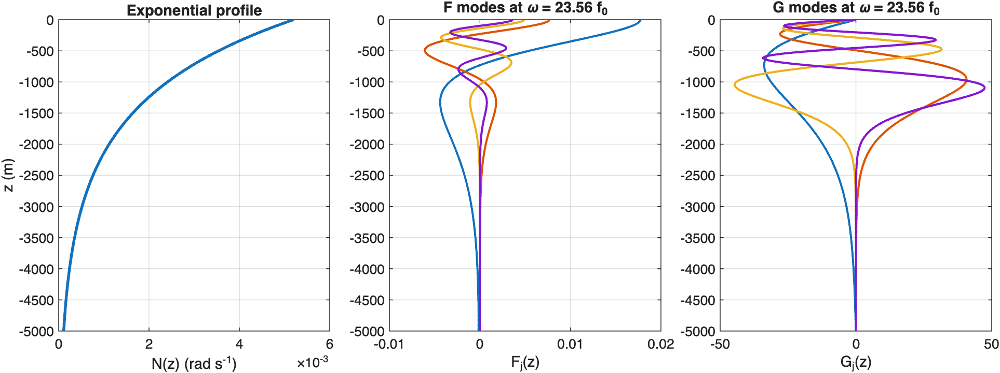
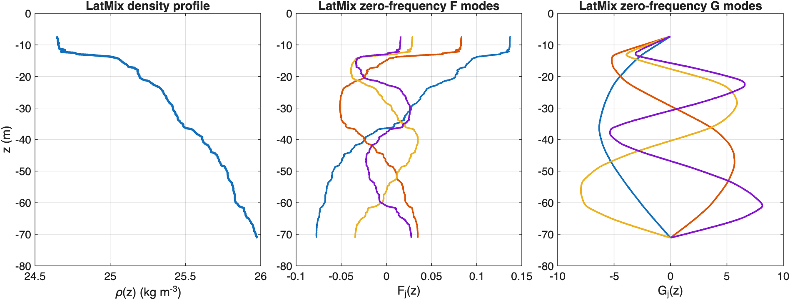

# Internal Modes Basics

Initialize InternalModesSpectral, compute zero-frequency and fixed-frequency modes, and repeat the workflow for a realistic LatMix profile.

Source: `Examples/Tutorials/InternalModesBasics.m`

## Initialize `InternalModesSpectral` from an exponential profile

This tutorial shows the minimum workflow for computing and plotting
vertical modes with
[`InternalModesSpectral`](../classes/numerical-solvers/internalmodesspectral).
The same overall pattern also appears in
[`InternalModesWKBSpectral`](../classes/numerical-solvers/internalmodeswkbspectral),
[`InternalModesAdaptiveSpectral`](../classes/numerical-solvers/internalmodesadaptivespectral),
[`InternalModesDensitySpectral`](../classes/numerical-solvers/internalmodesdensityspectral),
and [`InternalModesFiniteDifference`](../classes/numerical-solvers/internalmodesfinitedifference).

We start from the standard exponential stratification

$$
N^2(z) = N_0^2 e^{2 z / b},
$$

sample the implied density profile on a depth grid, and initialize the
spectral solver on a denser output grid for plotting.

```matlab
rho0 = 1025;
g = 9.81;
latitude = 33;
N0 = 5.2e-3;
b = 1300;
nEVP = 257;
nPlot = 4;

zIn = linspace(-5000, 0, nEVP).';
zOut = linspace(zIn(1), zIn(end), 1024).';
rho = rho0 * (1 + (b * N0^2 / (2 * g)) * (1 - exp(2 * zIn / b)));

im = InternalModesSpectral(rho=rho, zIn=zIn, zOut=zOut, latitude=latitude, nEVP=nEVP);
```

## Compute the zero-frequency modes

The simplest first solve is the zero-frequency call
[`ModesAtFrequency`](../classes/numerical-solvers/internalmodesspectral/modesatfrequency),
which we use here as the hydrostatic starting point.

```matlab
[F0, G0, h0, k0] = im.ModesAtFrequency(0); %#ok<NASGU>

figure(Color="w", Position=[100 100 980 360])
tiledlayout(1, 3, TileSpacing="compact", Padding="compact")

nexttile
plot(sqrt(im.N2), im.z, LineWidth=2)
xlabel("N(z) (rad s^{-1})")
ylabel("z (m)")
title("Exponential profile")
grid on

nexttile
plot(F0(:, 1:nPlot), im.z, LineWidth=1.5)
xlabel("F_j(z)")
title("Zero-frequency F modes")
grid on

nexttile
plot(G0(:, 1:nPlot), im.z, LineWidth=1.5)
xlabel("G_j(z)")
title("Zero-frequency G modes")
grid on
```



*The zero-frequency solve gives a clean first look at the leading vertical modes for the standard exponential stratification.*

## Compute modes at a nonzero frequency

To move away from the zero-frequency limit, choose a representative
frequency between `f0` and the largest buoyancy frequency in the water
column.

The companion fixed-wavenumber problem is also available through
[`ModesAtWavenumber`](../classes/numerical-solvers/internalmodesspectral/modesatwavenumber),
which returns `[F, G, h, omega]` for a chosen horizontal wavenumber `k`.

```matlab
omega = im.f0 + 0.35 * (max(sqrt(im.N2)) - im.f0);
[Fomega, Gomega, homega, kwave] = im.ModesAtFrequency(omega); %#ok<NASGU>

figure(Color="w", Position=[100 100 980 360])
tiledlayout(1, 3, TileSpacing="compact", Padding="compact")

nexttile
plot(sqrt(im.N2), im.z, LineWidth=2)
xlabel("N(z) (rad s^{-1})")
ylabel("z (m)")
title("Exponential profile")
grid on

nexttile
plot(Fomega(:, 1:nPlot), im.z, LineWidth=1.5)
xlabel("F_j(z)")
title(sprintf("F modes at \\omega = %.2f f_0", omega / im.f0))
grid on

nexttile
plot(Gomega(:, 1:nPlot), im.z, LineWidth=1.5)
xlabel("G_j(z)")
title(sprintf("G modes at \\omega = %.2f f_0", omega / im.f0))
grid on
```



*Choosing a nonzero frequency shifts the modal structure while keeping the same InternalModesSpectral workflow.*

## Compute modes for a realistic LatMix profile

The same solver can be initialized directly from a gridded observed
profile. Here we load the first stored Site 1 LatMix profile that ships
with the examples.

```matlab
scriptDir = fileparts(mfilename("fullpath"));
latmixData = load(fullfile(scriptDir, "..", "SampleLatmixProfiles.mat"));

rhoLatMix = latmixData.rhoProfile{1};
zLatMix = latmixData.zProfile{1};
latitudeLatMix = latmixData.latitude;
zOutLatMix = linspace(zLatMix(1), zLatMix(end), 1024).';

imLatMix = InternalModesSpectral(rho=rhoLatMix, zIn=zLatMix, zOut=zOutLatMix, latitude=latitudeLatMix, nEVP=nEVP);
[FLatMix, GLatMix, hLatMix, kLatMix] = imLatMix.ModesAtFrequency(0); %#ok<NASGU>

figure(Color="w", Position=[100 100 980 360])
tiledlayout(1, 3, TileSpacing="compact", Padding="compact")

nexttile
plot(imLatMix.rho, imLatMix.z, LineWidth=2)
xlabel("\rho(z) (kg m^{-3})")
ylabel("z (m)")
title("LatMix density profile")
grid on

nexttile
plot(FLatMix(:, 1:nPlot), imLatMix.z, LineWidth=1.5)
xlabel("F_j(z)")
title("LatMix zero-frequency F modes")
grid on

nexttile
plot(GLatMix(:, 1:nPlot), imLatMix.z, LineWidth=1.5)
xlabel("G_j(z)")
title("LatMix zero-frequency G modes")
grid on
```



*InternalModesSpectral works directly on the realistic LatMix profile and returns the leading zero-frequency modes on the requested output grid.*

## Choose the solver to match the profile

This LatMix density profile is not monotonic, so
[`InternalModesWKBSpectral`](../classes/numerical-solvers/internalmodeswkbspectral)
is not a good choice for this case. The depth-coordinate
[`InternalModesSpectral`](../classes/numerical-solvers/internalmodesspectral)
solver still works directly on the supplied profile, which makes it a
convenient default for realistic profiles like this one.

